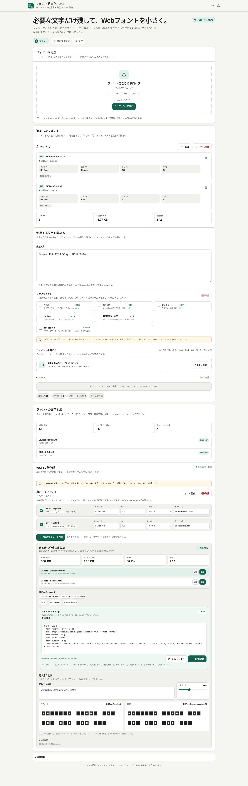

# フォント軽量化 / Font Subsetter

[](https://github.com/ttomohisa/htmlapps-font-subsetter/actions/workflows/deploy-pages.yml)
[](LICENSE)
[](https://ttomohisa.github.io/htmlapps-font-subsetter/)

[English README](README.md)

Webサイトで実際に使う文字を集め、必要な文字だけを残した軽量なWOFF2 Webフォントを、フォントや文章をサーバーへアップロードせずブラウザ内で作成する単一HTMLアプリです。

## 🚀 デモ

### [GitHub PagesでFont Subsetterを開く](https://ttomohisa.github.io/htmlapps-font-subsetter/)

GitHub Pagesから最初のHTMLを読み込んだ後、フォント情報の確認、文字収集、文字対応チェック、サブセット生成、比較プレビュー、CSS生成、ZIP書き出しは端末内で処理されます。選択したフォントやソースファイルをアプリがサーバーへアップロードすることはありません。

[](https://ttomohisa.github.io/htmlapps-font-subsetter/)

## 主な機能

ヘッダーの言語切替は切替先の `EN` / `JA` を表示し、説明とツールチップも現在の言語に合わせます。バージョン表示は `v1.0.1`、処理バッジは「完全ローカル処理」です。

- **実際に使う文字をまとめて収集** — 文章の直接入力、日本語プリセット、ローカルのTXT / MD / CSV / JSON / YAML / HTML / CSS / JS / TS / XML / SVGから文字を集められます。
- **不足文字を生成前に確認** — ブラウザの代替フォント表示ではなく各フォントの `cmap` を読み、不足文字とUnicodeコードポイントを具体的に表示します。
- **文字対応レポートをコピー** — 必要文字数、フォントごとの状態・対応数・不足数と、各フォント最大500件の不足Unicodeラベルをテキストでコピーできます。確認できない文字対応は不明のまま表示します。
- **サブセット制限を生成前に確認** — OS/2 `fsType` と取得できるライセンス情報を表示します。No Subsetting / Bitmap Embedding Onlyは生成を停止し、Restricted Licenseは明示的な権利・許可の確認が必要です。
- **複数フォントをまとめて軽量化** — Regular / Bold / Italicなど複数のTTF / OTFへ同じ文字セットを適用し、family / weight / style / 出力ファイル名をフォントごとに編集できます。
- **Variable Fontを保持** — 対応するCFF2 / `fvar`ベースのVariable Fontは、可変情報を保持したままサブセットします。
- **元フォントと生成後を比較** — 同じ文章を元フォントと生成WOFF2で横並び表示し、比較文と16〜72 pxの文字サイズを変更できます。
- **Webでそのまま使える形で保存** — `@font-face` CSSと `unicode-range` を生成し、個別WOFF2または `fonts/*.woff2` / `fonts.css` / `demo.html` / `manifest.json` をまとめたZIPを保存できます。
- **完全ローカル処理の単一HTML** — HarfBuzz、Brotli、Worker、常用漢字プリセットをHTMLへ内包し、実行時CSPは `connect-src 'none'` を維持します。

## すぐに使う

### Webで使う

[デモを開く](https://ttomohisa.github.io/htmlapps-font-subsetter/)だけで利用できます。インストールやアカウント登録は不要です。

### 単一HTMLをダウンロードして使う

1. [`dist/index.html`](https://github.com/ttomohisa/htmlapps-font-subsetter/blob/main/dist/index.html) をダウンロードします。
2. 最新のChromium系ブラウザ、Firefox、Safariで開きます。
3. フォントや文章・ソースファイルを追加します。処理はページ内で行われます。

`dist/index.self-extract.html` は、さらに小さいgzip自己展開版です。起動時に `DecompressionStream` で通常版HTMLを端末内に復元してからアプリを開始します。

### 自分でビルドして使う

1. このリポジトリをダウンロードまたはクローンします。
2. Windowsで `build-standalone.bat` をダブルクリックします。
3. 生成された `dist/index.html` または `dist/index.self-extract.html` を利用します。

標準のWindowsビルドではPython、Node.js、ローカルWebサーバーは不要です。Windows PowerShellと標準の `tar.exe` を使用します。

## 使い方

1. 1つまたは複数のフォントを追加します。生成元はTTF / OTFに対応し、WOFF / WOFF2も確認用として追加できます。
2. **文字**で残したい文章を入力する、文字プリセットを選ぶ、またはローカルのソースファイルを追加します。
3. **フォントの文字対応**で、各フォントと全体の不足文字を確認します。
4. フォントの `fsType` / ライセンス情報を確認します。Restricted Licenseのフォントを正当に利用できる場合だけ、そのフォントを個別に確認します。
5. **出力**で生成対象を選び、family / weight / style / 出力ファイル名を確認・編集します。
6. 選択したフォントをまとめて生成します。処理は1本ずつ行われるため、途中の1本が失敗しても後続フォントの処理を続けます。
7. 成功したフォントを選び、元フォントと生成後WOFF2を比較します。
8. 個別WOFF2を保存する、生成CSSをコピーする、または `font-subset.zip` を保存します。

### 文字ソースとプリセット

TXT、MD、CSV、JSON、YAML/YML、HTML/HTM、CSS、JS/MJS、TS、XML、SVGを文字ソースとして読み込めます。UTF-8、UTF-8 BOM、UTF-16LE BOM、UTF-16BE BOMに対応します。Shift_JISは自動判定しません。

HTML / XML / SVGは実行せずに解析します。直接入力・選択したプリセット・正常に読めたファイルの文字をUnicodeコードポイント単位で統合し、重複を除去します。

日本語プリセットにはASCII、基本記号、ひらがな、カタカナ、常用漢字2,136字、日本語まとめがあります。「日本語まとめ」は開始用セットであり、人名・地名・異体字・表外漢字など日本語で使われるすべての文字を保証しません。実際にサイトで使う文章も追加してください。

### 文字対応とフォント内の制限

文字対応はフォントの `cmap` を読み、ブラウザの代替フォント表示には依存しません。不足文字は文字そのものと `U+XXXX` / `U+XXXXXX` で確認できます。

「フォントの文字対応」の **文字対応レポートをコピー** で現在の状態をコピーできます。全件数を保持し、各フォントの不足Unicodeラベルが500件を超える場合は省略を明記します。ファイル名は引用・エスケープし、元フォントのデータや入力文章は含めません。自動保存やZIPへの追加は行いません。既存の **不足文字をコピー** は不足文字の全件をコピーします。

文字とフォントがそろい、読み込み確認が終わるまでボタンは無効です。クリップボードを利用できない場合は失敗を表示し、作業内容は変更しません。共有前にクリップボードの内容を確認してください。コードポイントごとの非ゼログリフ対応を示すもので、文字の組版やライセンスを保証するものではありません。

`fsType` はフォント内に保存された技術フラグであり、Webフォント利用の法的許諾を自動判定するものではありません。利用するフォントのライセンス / EULAも確認してください。

### Webfont Package

`font-subset.zip` には生成物だけを入れます。

```text
font-subset.zip
├─ fonts/
│  ├─ <font-1>.woff2
│  └─ <font-2>.woff2
├─ fonts.css
├─ demo.html
└─ manifest.json
```

元フォント、入力した文章、読み込んだソースファイルの本文はZIPへ含めません。`fonts.css` は `./fonts/...woff2` の相対パス、`font-display: swap`、そのフォントが実際に持つ要求文字から作った `unicode-range` を使用します。

## GitHub Pagesで公開する

このリポジトリには、単一HTMLをビルドして `dist/` をGitHub Pagesへ公開するワークフローが含まれています。

1. リポジトリ名を `htmlapps-font-subsetter` としてGitHubへプッシュします。
2. **Settings → Pages → Build and deployment → Source** で **GitHub Actions** を選択します。
3. `main` ブランチへプッシュするか、Actions画面から **Deploy standalone app to GitHub Pages** を手動実行します。
4. ビルド成功後、`https://ttomohisa.github.io/htmlapps-font-subsetter/` で利用できます。

`main` へのプッシュ時に、単一HTMLの再ビルド、リポジトリ/成果物検証、リリース成果物のアップロードを行い、GitHub Pagesが有効なら `dist/` を公開します。

## 開発とビルド

Node.jsで `node scripts/check-header-regression.mjs` を実行すると、実際のアプリスクリプトによる初期言語、繰り返し切替、設定の再読み込み、ストレージ利用不可時の動作、バージョンとローカル処理表示を検証できます。引数に `dist/index.html` または `dist/index.self-extract.html` を渡すと生成物も検証します。DOM境界を置き換えるソースレベルのテストで、ブラウザー表示の検証ではありません。

```text
.
├─ src/index.template.html       # アプリ本体のテンプレート
├─ app.config.json               # アプリ情報とリリース版数
├─ vendor/                       # 固定HarfBuzz/Brotliランタイム・プリセットデータ
├─ test-data/                    # 自作の回帰テストデータ
├─ tests/                        # リリース/単一HTMLの回帰テスト
├─ build-standalone.bat          # Windows用ビルド入口
├─ build-standalone.ps1          # 単一HTMLビルダー
├─ assets/favicon.svg            # favicon / ヘッダー共通アイコン
├─ dist/index.html               # 通常の単一HTML版
├─ dist/index.self-extract.html  # gzip自己展開版
└─ .github/workflows/
   ├─ build-standalone.yml       # Pull Request時のビルド検証
   └─ deploy-pages.yml           # mainからPagesへ自動公開
```

### ビルド時の処理

ビルダーは以下を行います。

- 固定したHarfBuzz/Brotliランタイムと常用漢字プリセットを単一HTMLへ内包
- 容量の大きいHarfBuzz/Brotliをgzip圧縮して保持し、初回生成時だけブラウザ内で展開
- 内包アセットの情報とSHA-256を記録
- 通常版と自己展開版の両方を生成
- 実行時通信を禁止する制限の強いCSPを維持
- `dist/` にbuild/dependency/self-extract manifestを生成

生成済みHTMLは直接編集せず、`src/index.template.html`、`app.config.json`、vendor元データを変更して再ビルドしてください。

### ブラウザ回帰テスト

再ビルド後、既存のNode.js用Playwrightテスト環境で `node tests/release_filename_safety.cjs` を実行します。テスト環境がリポジトリ外にある場合は、その `node_modules` ディレクトリを `NODE_PATH` に指定します。Windowsでインストール済みMicrosoft Edgeを使う例:

```powershell
$env:NODE_PATH = 'C:\path\to\test-runtime\node_modules'
$env:PLAYWRIGHT_BROWSER_CHANNEL = 'msedge'
node tests/release_filename_safety.cjs
node tests/release_font_export.cjs
```

フォント出力の回帰テストは両方のローカル版で2書体を生成し、保存したWOFF2を `FontFace` で再読み込みして、実行時通信ゼロでZIPを出力します。

ブラウザ指定を省略するとPlaywrightのChromiumを使います。通常版と自己展開版をローカルで開き、記号を含むファイル名の表示・選択、日本語/英語、デスクトップ/スマートフォン、実行時通信ゼロを確認します。

### 文字対応レポートの回帰テスト

Node.js 18以降で `node --test tests/coverage-report.test.cjs` を実行します。`FONT_COVERAGE_HTML` に生成HTMLのパスを指定すると同じテストを配布版にも適用できます。実際のソース関数と独自の矩形グリフだけを持つ合成フォントを使うテストで、既存のブラウザでの出力・ファイル名テストを置き換えるものではありません。フィクスチャを再生成する場合のみ、FontToolsを用意して `python tests/fixtures/make_synthetic_font.py` を実行します。アプリの利用と標準ビルドにNode.jsやFontToolsは不要です。

## プライバシーと通信防止

生成されたアプリは完全ローカル処理を前提にしています。

- フォントバイトとソース文章はブラウザメモリ内で処理
- 元フォントや入力文章をWebfont Packageへ含めない
- 登録、Analytics、telemetry、クラウド保存、CDN、実行時API不要
- CSPに `connect-src 'none'` を設定
- HarfBuzz、Brotli、subset Worker、プリセットデータをHTMLへ内包
- `localStorage` に保存するのは言語などのUI設定だけで、フォントやソースファイル本文は保存しない

GitHub Pages版では最初のHTML配信は発生しますが、ページ読み込み後の処理のために選択したファイルをアプリがアップロードする必要はありません。ネットワークを切って利用する場合は、ブラウザや環境がローカルHTML実行を許可している端末で生成済み単一HTMLを開いてください。

## 制限事項

- v1.0.1でサブセット生成元として使えるのはTTF / OTFです。WOFFは確認できますが生成元には使いません。
- WOFF2は入力できますが、内部テーブルをまだ展開しないため、WOFF2入力の `cmap` 文字対応と `fsType` は「確認できません」と表示します。
- TTC / OTCのface選択には対応していません。
- Shift_JISのソースファイルは自動判定しません。
- 不足文字があっても生成は可能ですが、その文字は該当フォントの出力には入りません。
- 日本語プリセットは人名・地名・異体字・表外漢字・記号をすべて網羅するものではありません。
- Variable Fontのaxis固定には対応していません。対応するVariable Fontは可変のまま保持します。
- カラーフォント形式や一部の特殊なレイアウト方式はbest effortで、v1.0.1の互換保証対象外です。
- `fsType` だけではWebフォント利用のライセンス可否を判断できません。
- 大きなフォントや多数の同時入力ではブラウザメモリを多く使用します。フォントは1ファイル100 MB、最大12ファイル、合計300 MBまでです。
- 文字ソースは1ファイル10 MB、最大200ファイル、合計50 MBまでです。

## 使用ライブラリ

| ライブラリ / データ | バージョン | ライセンス | 用途 |
| --- | --- | --- | --- |
| harfbuzzjs / HarfBuzz | commit `78b9927` | MIT / HarfBuzz permissive license | TTF/OTFサブセット生成 |
| brotli.js | 1.3.3 | MIT | WOFF2テーブル圧縮 |
| base64-js | 1.5.1 | MIT | 内包Brotli bundleの依存 |
| 常用漢字プリセットデータ | 2010年表・2,136字 | application data | 日本語文字プリセット |

これらを実行時に外部から取得することはありません。正確なハッシュと出典は [THIRD_PARTY_NOTICES.md](THIRD_PARTY_NOTICES.md) と [`vendor/README.md`](vendor/README.md) を確認してください。

## テストデータ

`test-data/` には、文字対応、複数フォント、`fsType`、文字ソース、Webfont Packageを確認するための自作フォント/ソースデータがあります。フォントfixtureはテスト専用に生成したもので、第三者フォントの字形を再配布するものではありません。

## コントリビューション

バグ報告や機能提案はGitHub Issuesからお願いします。開発方法は [CONTRIBUTING.md](CONTRIBUTING.md) を確認してください。

## ライセンス

Copyright © 2026 ttomohisa

このプロジェクトは [MIT License](LICENSE) で公開されています。
