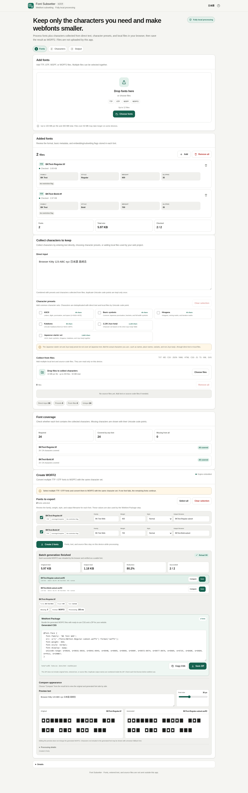

# Font Subsetter

[](https://github.com/ttomohisa/htmlapps-font-subsetter/actions/workflows/deploy-pages.yml)
[](LICENSE)
[](https://ttomohisa.github.io/htmlapps-font-subsetter/)

[日本語版 README](README.ja.md)

A single-HTML app for collecting the characters a web project actually uses and creating smaller WOFF2 webfonts without uploading fonts or source text to a server.

## 🚀 Live demo

### [Open Font Subsetter on GitHub Pages](https://ttomohisa.github.io/htmlapps-font-subsetter/)

GitHub Pages delivers the initial HTML. After it loads, font inspection, character collection, coverage checks, subsetting, preview, CSS generation, and ZIP export are processed locally on your device. The fonts and source files you select are not uploaded by the app.

[](https://ttomohisa.github.io/htmlapps-font-subsetter/)

## Features

- **Collect the characters your site really uses** — Enter text directly, select Japanese presets, or add local TXT / MD / CSV / JSON / YAML / HTML / CSS / JS / TS / XML / SVG files.
- **See missing characters before export** — Coverage is checked from each font's `cmap`, with concrete missing characters and Unicode code points instead of relying on browser fallback rendering.
- **Review font restrictions before subsetting** — Inspect OS/2 `fsType` and available license metadata. No Subsetting and Bitmap Embedding Only fonts are blocked; Restricted License fonts require an explicit rights/permission acknowledgement.
- **Subset multiple fonts together** — Process Regular / Bold / Italic and other TTF / OTF files with one shared character set while editing family, weight, style, and output filename per font.
- **Keep Variable Fonts variable** — CFF2 / `fvar`-based Variable Fonts remain variable during supported subsetting workflows.
- **Compare before and after** — Load the original font and generated WOFF2 side by side with editable preview text and a shared 16–72 px size control.
- **Export ready-to-use webfont assets** — Copy generated `@font-face` CSS with `unicode-range`, save individual WOFF2 files, or download a package containing `fonts/*.woff2`, `fonts.css`, `demo.html`, and `manifest.json`.
- **Fully local, single-HTML operation** — HarfBuzz, Brotli, Worker code, and the Joyo Kanji preset are embedded in the standalone app. Runtime CSP keeps `connect-src 'none'`.

## Quick start

### Use the web demo

Just [open the demo](https://ttomohisa.github.io/htmlapps-font-subsetter/). No installation or account is required.

### Use the downloaded single HTML

1. Download [`dist/index.html`](https://github.com/ttomohisa/htmlapps-font-subsetter/blob/main/dist/index.html).
2. Open it in a current Chromium-based browser, Firefox, or Safari.
3. Add your fonts and source text/files. Everything is processed in the page.

`dist/index.self-extract.html` is a smaller gzip self-extracting variant. It restores the normal standalone HTML locally with `DecompressionStream` before the app starts.

### Build it yourself

1. Download or clone this repository.
2. On Windows, double-click `build-standalone.bat`.
3. Use the generated `dist/index.html` or `dist/index.self-extract.html`.

Python, Node.js, and a local web server are not required for the standard Windows build. The builder uses Windows PowerShell and the built-in `tar.exe`.

## Usage

1. Add one or more font files. TTF / OTF are supported as generation sources; WOFF / WOFF2 can also be added for inspection.
2. Open **Characters** and enter the text you want to keep, select presets, or add local source files.
3. Review **Font coverage** to see missing characters for each readable font and across the loaded set.
4. Check the font's `fsType` / license metadata. If a Restricted License font is legitimately authorized for your use, acknowledge that font individually.
5. Open **Output**, choose the fonts to generate, and review/edit family, weight, style, and output filename.
6. Generate the selected fonts. Processing runs one font at a time so one failure does not prevent later selected fonts from being attempted.
7. Select a successful output to compare the original font with the generated WOFF2.
8. Save individual WOFF2 files, copy the generated CSS, or download `font-subset.zip`.

### Character sources and presets

Supported source files are TXT, MD, CSV, JSON, YAML/YML, HTML/HTM, CSS, JS/MJS, TS, XML, and SVG. UTF-8, UTF-8 BOM, UTF-16LE BOM, and UTF-16BE BOM are supported. Shift_JIS is not auto-detected.

HTML / XML / SVG are parsed inertly; source code is not executed. Direct text, selected presets, and successfully read source files are merged by Unicode code point and deduplicated.

The built-in Japanese presets include printable ASCII, common Japanese symbols, Hiragana, Katakana, 2,136 Joyo Kanji, and a combined Japanese starter set. The starter set is intentionally not a guarantee for every Japanese string, so real project text should still be included for names, place names, variant forms, and non-Joyo kanji.

### Coverage and font restrictions

Coverage is read from the font's `cmap`, not from rendered fallback text. Missing characters are shown as the character plus `U+XXXX` / `U+XXXXXX`.

`fsType` is treated as a technical flag stored in the font, not as an automatic legal determination that webfont use is permitted. Check the font's license / EULA as well.

### Webfont package

`font-subset.zip` contains only generated assets:

```text
font-subset.zip
├─ fonts/
│  ├─ <font-1>.woff2
│  └─ <font-2>.woff2
├─ fonts.css
├─ demo.html
└─ manifest.json
```

Original font files, entered text, and imported source-file contents are not included in the package. `fonts.css` uses relative `./fonts/...woff2` URLs, `font-display: swap`, and per-font `unicode-range` values built from requested characters that the source font actually contains.

## Publish with GitHub Pages

The repository includes a workflow that builds the fully embedded HTML and deploys `dist/` to GitHub Pages.

1. Push the repository to GitHub as `htmlapps-font-subsetter`.
2. Open **Settings → Pages → Build and deployment → Source** and select **GitHub Actions**.
3. Push to `main`, or manually run **Deploy standalone app to GitHub Pages** from the Actions tab.
4. After a successful deployment, the app is available at `https://ttomohisa.github.io/htmlapps-font-subsetter/`.

Each push to `main` rebuilds the standalone HTML, verifies repository/build constraints, uploads the release artifacts, and publishes `dist/` when GitHub Pages is enabled.

## Development and build layout

```text
.
├─ src/index.template.html       # Application source template
├─ app.config.json               # App metadata and release version
├─ vendor/                       # Pinned HarfBuzz/Brotli runtime + preset data
├─ test-data/                    # Generated regression fixtures
├─ tests/                        # Release/standalone regression checks
├─ build-standalone.bat          # Windows build entry point
├─ build-standalone.ps1          # Single-HTML builder
├─ assets/favicon.svg            # Canonical favicon/header icon
├─ dist/index.html               # Readable standalone release
├─ dist/index.self-extract.html  # Gzip self-extracting release
└─ .github/workflows/
   ├─ build-standalone.yml       # Pull-request build validation
   └─ deploy-pages.yml           # Automatic Pages deployment from main
```

### Build behavior

The builder:

- embeds the pinned HarfBuzz/Brotli runtime and Joyo preset data into the standalone HTML;
- gzip-compresses the larger HarfBuzz/Brotli runtime assets for smaller HTML size and expands them locally on first generation;
- records embedded-asset metadata and SHA-256 hashes;
- generates both readable and self-extracting standalone variants;
- preserves a restrictive CSP with runtime connections disabled;
- generates build/dependency/self-extract manifests in `dist/`.

Do not edit generated HTML directly. Change `src/index.template.html`, `app.config.json`, or the vendored source assets, then rebuild.

## Privacy and runtime network protection

The generated app is designed for fully local processing:

- font bytes and source text stay in browser memory;
- original fonts and source text are not placed in the exported webfont package;
- no account, analytics, telemetry, cloud storage, CDN, or runtime API is required;
- CSP contains `connect-src 'none'`;
- HarfBuzz, Brotli, the subset Worker, and preset data are embedded in the HTML;
- only UI/language preferences are stored in `localStorage`; font files and source-file contents are not persisted there.

The GitHub Pages version still requires the initial HTML request. After the page loads, the app does not need to upload the selected files for its processing workflow. For disconnected use, use the generated standalone HTML locally where the browser/environment permits local file execution.

## Limitations

- TTF / OTF are the supported generation sources in v1.0.0. WOFF can be inspected but is not used as a generation source.
- WOFF2 input is accepted for file inspection, but its internal tables are not decoded by the app yet, so `cmap` coverage and `fsType` are shown as unavailable for WOFF2 input.
- TTC / OTC face selection is not supported.
- Shift_JIS source files are not auto-detected.
- Missing characters do not block generation; they simply cannot appear in that font's output.
- Japanese presets are practical starter sets, not complete coverage for every Japanese name, place, variant, or symbol.
- Variable Font axis pinning is not supported; supported Variable Fonts remain variable instead.
- Color-font formats and less common layout systems are best-effort and are not part of the v1.0.0 compatibility guarantee.
- `fsType` alone does not determine whether your license permits webfont use.
- Large fonts and many simultaneous inputs can consume substantial browser memory. Limits are 100 MB per font, 12 fonts, and 300 MB total font data.
- Character-source limits are 10 MB per file, 200 files, and 50 MB total source data.

## Dependencies

| Library / data | Version | License | Purpose |
| --- | --- | --- | --- |
| harfbuzzjs / HarfBuzz | commit `78b9927` | MIT / HarfBuzz permissive license | TTF/OTF subsetting |
| brotli.js | 1.3.3 | MIT | WOFF2 table compression |
| base64-js | 1.5.1 | MIT | Dependency used by the vendored Brotli bundle |
| Joyo Kanji preset data | 2010 table, 2,136 code points | application data | Japanese character preset |

The release does not fetch these dependencies at runtime. Exact hashes and provenance are recorded in [THIRD_PARTY_NOTICES.md](THIRD_PARTY_NOTICES.md) and [`vendor/README.md`](vendor/README.md).

## Test data

`test-data/` contains generated fonts and source files for coverage, multi-font, `fsType`, source-decoding, and Webfont Package regression tests. The font fixtures are purpose-built test data rather than redistributed third-party font artwork.

## Contributing

Bug reports and feature proposals are welcome through GitHub Issues. See [CONTRIBUTING.md](CONTRIBUTING.md) for development guidance.

## License

Copyright © 2026 ttomohisa

Licensed under the [MIT License](LICENSE).
